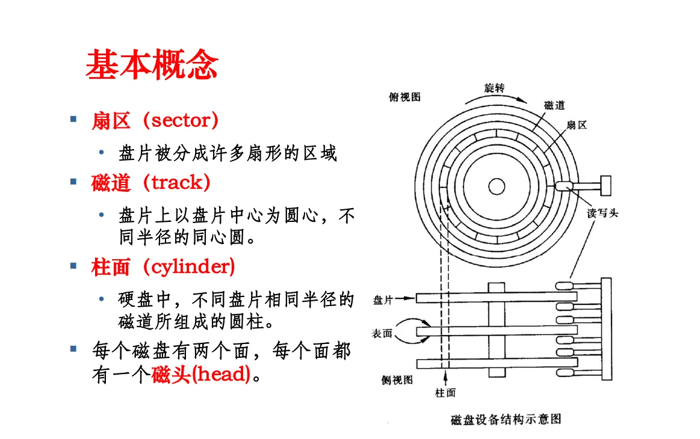

# 1. 磁盘
# 1.1 接口(SATA | SCSI | SAS | PCI-E)
* 磁盘有两种接口，分别是SATA和SAS接口；
* SATA接口是串行接口，SAS接口是并行接口；
* SATA硬盘，转速在5400和7200转居多。
* SAS硬盘，基本都是10000转或者15000转，配备旋转震动补偿以保证数据准确度，因此具有更高的可靠性；
* 磁盘的接口速度，一般用MB/s来表示，MB/s=1024*1024/8；
